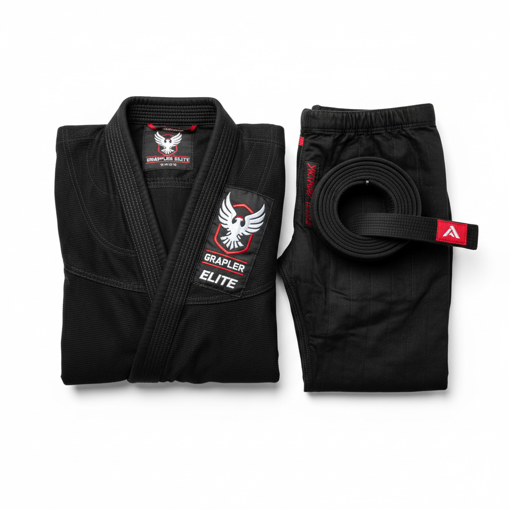

# Xelent MMA Homepage Enhancement Plan
## Comprehensive Design Audit & Implementation Guide

**Audit Date:** March 18, 2026  
**Current Score:** 6.5/10  
**Target Score:** 9/10  
**Estimated Implementation Time:** 3-4 weeks

---

## Table of Contents
1. [Executive Summary](#executive-summary)
2. [Critical Issues (Week 1)](#critical-issues-week-1)
3. [Moderate Issues (Week 2)](#moderate-issues-week-2)
4. [Enhancements (Week 3)](#enhancements-week-3)
5. [Polish & Optimization (Week 4)](#polish--optimization-week-4)
6. [Mobile-Specific Fixes](#mobile-specific-fixes)
7. [Competitor Comparison Matrix](#competitor-comparison-matrix)
8. [Code Snippets & Implementation](#code-snippets--implementation)
9. [Asset Requirements](#asset-requirements)
10. [Success Metrics](#success-metrics)

---

## Executive Summary

### Current State Analysis
Your Xelent MMA homepage has a solid foundation with good structural organization and brand storytelling. However, compared to leading BJJ/MMA brands (Shoyoroll, Tatami, Hayabusa, Venum, Sanabul), it lacks critical conversion elements and professional polish.

### Quick Wins
1. Add real Xelent logo (replaces emoji)
2. Implement trust bar at top of page
3. Add color swatches to product cards
4. Fix mobile hero image positioning
5. Add urgency badges to products

### Key Differentiators to Leverage
- **Sialkot, Pakistan origin** - unique story no competitor has
- **Direct manufacturing** - enable "small batch" messaging
- **Regional athletes** - feature fighters from Pakistan/Middle East

---

## Critical Issues (Week 1)

### 🔴 Issue #1: Missing Professional Logo

**Current State:**
```html
<div class="logo-icon">🥋</div>
```

**Problem:** Emoji looks amateur and hurts brand credibility

**Competitor Reference:**
- Shoyoroll: Clean wordmark with distinctive "S" logo
- Hayabusa: Stylized kanji logo with premium feel
- Venum: Iconic snake head instantly recognizable

**Solution:**
```html
<!-- Replace emoji with actual logo -->
<div class="logo-icon">
    
</div>
```

**Implementation Steps:**
1. Create Xelent logo SVG (or use existing brand assets)
2. Update logo in navigation
3. Add logo to footer
4. Create favicon from logo
5. Update all page headers

**Priority:** P0 - Launch Blocker

---

### 🔴 Issue #2: Hero Image Mobile Performance

**Current State:**
```css
.hero {
    background-attachment: fixed;
    background-position: center right;
}
```

**Problems:**
- `background-attachment: fixed` causes jank on mobile
- Fighter gets awkwardly cropped on small screens
- Text becomes hard to read

**Competitor Reference:**
- Tatami: Uses `` tag with `object-fit: cover`
- Shoyoroll: Dedicated mobile hero images
- Sanabul: Responsive background positions

**Solution:**
```css
/* Desktop */
.hero {
    background: url('images/hero-fighter.png') center right/cover no-repeat;
    background-attachment: fixed;
}

/* Tablet */
@media (max-width: 1024px) {
    .hero {
        background-position: 65% center;
        background-attachment: scroll;
    }
}

/* Mobile */
@media (max-width: 768px) {
    .hero {
        background-position: 75% center;
        background-attachment: scroll;
    }
    
    .hero-overlay {
        background: linear-gradient(90deg, 
            rgba(0,0,0,0.95) 0%, 
            rgba(0,0,0,0.88) 60%, 
            rgba(0,0,0,0.7) 100%);
    }
}
```

**Alternative Approach (Recommended):**
```html
<!-- Use picture element for responsive images -->
<picture>
    <source media="(max-width: 768px)" srcset="images/hero-mobile.jpg">
    <source media="(max-width: 1024px)" srcset="images/hero-tablet.jpg">
    
</picture>
```

**Priority:** P0 - Launch Blocker

---

### 🔴 Issue #3: Missing Product Images

**Current State:**
```html

```

**Problem:** Placeholder references = broken images = instant bounce

**Competitor Reference:**
- Hayabusa: Professional white-background product photography
- Tatami: Multiple angles + lifestyle shots
- Shoyoroll: Artistic, high-end product imagery

**Solution - Immediate (Temporary):**
Generate AI product images using prompts from `image-generation-prompts.md`

**Solution - Long-term:**
Hire professional product photographer or set up lightbox for:
- BJJ Gi (Black, White, Blue, Navy) - front, back, detail shots
- Rashguards - flat lay + model shots
- Fight Shorts - flat lay + action shots
- Accessories - styled product shots

**Priority:** P0 - Launch Blocker

---

### 🔴 Issue #4: Missing Top Trust Bar

**Current State:** Trust badges only in hero section

**Competitor Reference:**
- Venum: Trust bar at very top (Free delivery, Secure payment, Customer service)
- Sanabul: "40,000+ Five Star Reviews" prominently displayed
- Tatami: IBJJF badges on all competition gear

**Solution:**
```html
<!-- Add before navigation -->
<div class="trust-bar">
    <div class="trust-bar-content">
        <span class="trust-item">
            <i data-lucide="truck"></i>
            Free Shipping $100+
        </span>
        <span class="trust-item">
            <i data-lucide="shield-check"></i>
            IBJJF Approved
        </span>
        <span class="trust-item">
            <i data-lucide="star"></i>
            4.9/5 (500+ Reviews)
        </span>
        <span class="trust-item">
            <i data-lucide="package"></i>
            Made in Sialkot
        </span>
    </div>
</div>
```

```css
.trust-bar {
    background: var(--black);
    border-bottom: 1px solid var(--border);
    padding: 0.75rem 2rem;
}

.trust-bar-content {
    max-width: 1400px;
    margin: 0 auto;
    display: flex;
    justify-content: center;
    gap: 3rem;
    flex-wrap: wrap;
}

.trust-item {
    display: flex;
    align-items: center;
    gap: 0.5rem;
    font-size: 0.85rem;
    color: var(--gray-400);
}

.trust-item i {
    color: var(--red);
    width: 16px;
    height: 16px;
}

@media (max-width: 768px) {
    .trust-bar-content {
        gap: 1rem;
        font-size: 0.75rem;
    }
    
    .trust-item:nth-child(3),
    .trust-item:nth-child(4) {
        display: none; /* Show only 2 on mobile */
    }
}
```

**Priority:** P0 - High Impact

---

## Moderate Issues (Week 2)

### 🟡 Issue #5: Product Cards Lack Details

**Current State:**
- Product name
- Price
- Rating

**Competitor Comparison:**

| Feature | Xelent (Current) | Hayabusa | Tatami | Shoyoroll |
|---------|-----------------|----------|--------|-----------|
| Color Swatches | ❌ | ✅ | ✅ | ❌ |
| Quick Specs | ❌ | ✅ | ✅ | ✅ |
| Sale Badges | ✅ | ✅ | ✅ | ✅ |
| Hover Images | ❌ | ✅ | ✅ | ✅ |
| Compare Button | ❌ | ✅ | ❌ | ❌ |

**Enhanced Product Card:**
```html
<div class="product-card">
    <div class="product-badges">
        <span class="badge badge-new">New</span>
        <span class="badge badge-batch">Batch #12</span>
    </div>
    
    <div class="product-image">
        
        
        
        <div class="color-swatches">
            <button class="swatch active" data-color="black" style="background: #000;"></button>
            <button class="swatch" data-color="white" style="background: #fff;"></button>
            <button class="swatch" data-color="blue" style="background: #1e40af;"></button>
            <button class="swatch" data-color="navy" style="background: #1e3a5f;"></button>
        </div>
        
        <button class="quick-add">Quick Add</button>
    </div>
    
    <div class="product-info">
        <div class="product-specs">450gsm Pearl Weave • IBJJF Legal</div>
        <div class="product-category">BJJ Gi</div>
        <h3 class="product-name">Elite Pro Gi</h3>
        
        <div class="product-rating">
            <span class="stars">★★★★★</span>
            <span class="rating-count">(128 reviews)</span>
        </div>
        
        <div class="product-price">
            <span class="current-price">$149</span>
            <span class="original-price">$179</span>
            <span class="savings">Save $30</span>
        </div>
        
        <div class="stock-status">
            <span class="in-stock">✓ In Stock</span>
            <span class="low-stock" style="display: none;">Only 5 left!</span>
        </div>
    </div>
</div>
```

```css
.product-card {
    position: relative;
    background: var(--surface);
    border: 1px solid var(--border);
    border-radius: 16px;
    overflow: hidden;
    transition: all 0.4s cubic-bezier(0.34, 1.56, 0.64, 1);
}

.product-card:hover {
    transform: translateY(-8px);
    border-color: var(--red);
    box-shadow: 0 20px 40px rgba(220, 38, 38, 0.15);
}

.product-image {
    position: relative;
    height: 280px;
    overflow: hidden;
}

.product-image img {
    width: 100%;
    height: 100%;
    object-fit: cover;
    transition: opacity 0.3s ease;
}

.hover-img {
    position: absolute;
    top: 0;
    left: 0;
    opacity: 0;
}

.product-card:hover .hover-img {
    opacity: 1;
}

.product-card:hover .primary-img {
    opacity: 0;
}

.color-swatches {
    position: absolute;
    bottom: 1rem;
    left: 50%;
    transform: translateX(-50%);
    display: flex;
    gap: 0.5rem;
    opacity: 0;
    transition: opacity 0.3s ease;
}

.product-card:hover .color-swatches {
    opacity: 1;
}

.swatch {
    width: 24px;
    height: 24px;
    border-radius: 50%;
    border: 2px solid transparent;
    cursor: pointer;
    transition: transform 0.2s ease;
}

.swatch:hover {
    transform: scale(1.2);
}

.swatch.active {
    border-color: var(--red);
    box-shadow: 0 0 0 2px var(--surface), 0 0 0 4px var(--red);
}

.product-specs {
    font-size: 0.75rem;
    color: var(--gray-400);
    margin-bottom: 0.5rem;
}

.savings {
    color: var(--red);
    font-size: 0.85rem;
    font-weight: 600;
}

.stock-status {
    margin-top: 0.5rem;
    font-size: 0.85rem;
}

.in-stock {
    color: #22c55e;
}

.low-stock {
    color: var(--red);
    font-weight: 600;
}
```

**Priority:** P1 - High Impact

---

### 🟡 Issue #6: No Size Guide Integration

**Problem:** BJJ Gi sizing is complex (A0-A5). Cart abandonment increases without sizing help.

**Competitor Reference:**
- Tatami: Interactive size calculator
- Hayabusa: Size guide popup on every product card
- Sanabul: "Find Your Size" wizard

**Solution:**
```html
<!-- Size Helper Component -->
<div class="size-helper">
    <a href="#size-guide" class="size-guide-link" data-popup>
        <i data-lucide="ruler"></i>
        Size Guide
    </a>
    
    <div class="quick-size-calculator">
        <span>Find my size:</span>
        <div class="size-inputs">
            <select id="height">
                <option value="">Height</option>
                <option value="a0">5'0" - 5'4"</option>
                <option value="a1">5'4" - 5'8"</option>
                <option value="a2">5'8" - 6'0"</option>
                <option value="a3">6'0" - 6'3"</option>
                <option value="a4">6'3" - 6'6"</option>
                <option value="a5">6'6"+</option>
            </select>
            <select id="weight">
                <option value="">Weight</option>
                <option value="a0">Under 130 lbs</option>
                <option value="a1">130-155 lbs</option>
                <option value="a2">155-190 lbs</option>
                <option value="a3">190-220 lbs</option>
                <option value="a4">220-250 lbs</option>
                <option value="a5">250+ lbs</option>
            </select>
        </div>
        <div class="size-recommendation" style="display: none;">
            <strong>Recommended: <span class="size-result">A2</span></strong>
        </div>
    </div>
</div>
```

```javascript
// Size Calculator Logic
const heightSelect = document.getElementById('height');
const weightSelect = document.getElementById('weight');
const recommendation = document.querySelector('.size-recommendation');
const sizeResult = document.querySelector('.size-result');

function calculateSize() {
    const height = heightSelect.value;
    const weight = weightSelect.value;
    
    if (height && weight) {
        // Simple algorithm - can be enhanced
        const sizes = { a0: 0, a1: 1, a2: 2, a3: 3, a4: 4, a5: 5 };
        const heightSize = sizes[height];
        const weightSize = sizes[weight];
        
        // Average of height and weight
        const avgSize = Math.round((heightSize + weightSize) / 2);
        const sizeKeys = Object.keys(sizes);
        const recommendedSize = sizeKeys[avgSize].toUpperCase();
        
        sizeResult.textContent = recommendedSize;
        recommendation.style.display = 'block';
    }
}

heightSelect.addEventListener('change', calculateSize);
weightSelect.addEventListener('change', calculateSize);
```

**Priority:** P1 - Reduces Cart Abandonment

---

### 🟡 Issue #7: No Urgency/Scarcity Elements

**Competitor Analysis:**
- Shoyoroll: "Batch #147" - collectible mentality
- Sanabul: "SALE ENDS IN 2 DAYS" countdown timers
- Tatami: Stock counters ("Only 3 left!")

**Your Opportunity:** "Small Batch Craftsmanship"

```html
<!-- Urgency Badges -->
<span class="badge badge-batch">Batch #12 • Only 50 Made</span>
<span class="badge badge-urgency">🔥 Selling Fast</span>
<span class="badge badge-low-stock">Only 3 left!</span>

<!-- Countdown Timer -->
<div class="countdown-timer">
    <span class="timer-label">Sale Ends In:</span>
    <div class="timer">
        <span class="time-unit">
            <span class="number" id="hours">23</span>
            <span class="label">hrs</span>
        </span>
        <span class="time-unit">
            <span class="number" id="minutes">45</span>
            <span class="label">min</span>
        </span>
        <span class="time-unit">
            <span class="number" id="seconds">12</span>
            <span class="label">sec</span>
        </span>
    </div>
</div>
```

```css
.badge-batch {
    background: linear-gradient(135deg, var(--gold), var(--gold-dark));
    color: var(--black);
}

.badge-urgency {
    background: linear-gradient(135deg, var(--red), #ff4444);
    color: white;
    animation: pulse 2s infinite;
}

@keyframes pulse {
    0%, 100% { opacity: 1; }
    50% { opacity: 0.8; }
}

.countdown-timer {
    background: rgba(220, 38, 38, 0.1);
    border: 1px solid rgba(220, 38, 38, 0.3);
    border-radius: 8px;
    padding: 1rem;
    text-align: center;
}

.timer {
    display: flex;
    justify-content: center;
    gap: 1rem;
    margin-top: 0.5rem;
}

.time-unit {
    display: flex;
    flex-direction: column;
    align-items: center;
}

.time-unit .number {
    font-family: 'Oswald', sans-serif;
    font-size: 2rem;
    font-weight: 700;
    color: var(--red);
}

.time-unit .label {
    font-size: 0.75rem;
    color: var(--gray-400);
    text-transform: uppercase;
}
```

**Priority:** P1 - Increases Conversion Rate

---

## Enhancements (Week 3)

### 🟢 Issue #8: Add "Gi Finder" Product Quiz

**Competitor Reference:** Hayabusa's "Glove Finder" - interactive tool that guides users to the right product

**Implementation:**
```html
<section class="gi-finder">
    <div class="container">
        <h2>Find Your Perfect <span>Gi</span></h2>
        <p>Answer 3 quick questions and we'll recommend the best gi for you</p>
        
        <div class="quiz-container">
            <!-- Step 1 -->
            <div class="quiz-step active" data-step="1">
                <h3>What's your experience level?</h3>
                <div class="quiz-options">
                    <button class="quiz-option" data-value="beginner">
                        <span class="option-icon">🥋</span>
                        <span class="option-title">Beginner</span>
                        <span class="option-desc">Just starting my BJJ journey</span>
                    </button>
                    <button class="quiz-option" data-value="intermediate">
                        <span class="option-icon">💪</span>
                        <span class="option-title">Intermediate</span>
                        <span class="option-desc">Training 2-3 times per week</span>
                    </button>
                    <button class="quiz-option" data-value="competitor">
                        <span class="option-icon">🏆</span>
                        <span class="option-title">Competitor</span>
                        <span class="option-desc">Competing at tournaments</span>
                    </button>
                </div>
            </div>
            
            <!-- Step 2 -->
            <div class="quiz-step" data-step="2">
                <h3>What's your budget?</h3>
                <div class="quiz-options">
                    <button class="quiz-option" data-value="budget">
                        <span class="option-title">Under $100</span>
                        <span class="option-desc">Entry-level quality</span>
                    </button>
                    <button class="quiz-option" data-value="mid">
                        <span class="option-title">$100 - $150</span>
                        <span class="option-desc">Best value for money</span>
                    </button>
                    <button class="quiz-option" data-value="premium">
                        <span class="option-title">$150+</span>
                        <span class="option-desc">Premium competition gear</span>
                    </button>
                </div>
            </div>
            
            <!-- Step 3 -->
            <div class="quiz-step" data-step="3">
                <h3>Preferred color?</h3>
                <div class="quiz-options color-options">
                    <button class="quiz-option color-option" data-value="black" style="background: #000;"></button>
                    <button class="quiz-option color-option" data-value="white" style="background: #fff;"></button>
                    <button class="quiz-option color-option" data-value="blue" style="background: #1e40af;"></button>
                    <button class="quiz-option color-option" data-value="navy" style="background: #1e3a5f;"></button>
                </div>
            </div>
            
            <!-- Results -->
            <div class="quiz-result" style="display: none;">
                <h3>We recommend:</h3>
                <div class="recommended-product">
                    
                    <div class="product-details">
                        <h4>Elite Pro Gi</h4>
                        <p class="reason">Perfect for competitors who demand the best</p>
                        <div class="price">$149</div>
                        <a href="product.html" class="btn-primary">Shop Now</a>
                    </div>
                </div>
            </div>
        </div>
    </div>
</section>
```

**Priority:** P2 - Engagement & Conversion Boost

---

### 🟢 Issue #9: Athlete/Team Section

**Your Unique Advantage:** Feature Pakistani/Regional fighters - story no competitor has

```html
<section class="athletes">
    <div class="section-header">
        <span class="section-tag">Team Xelent</span>
        <h2 class="section-title">Proudly Worn by <span>Champions</span></h2>
        <p class="section-subtitle">From Sialkot to the world stage</p>
    </div>
    
    <div class="athletes-grid">
        <div class="athlete-card featured">
            <div class="athlete-image">
                
            </div>
            <div class="athlete-info">
                <span class="athlete-title">Pakistan National Champion</span>
                <h3>[Athlete Name]</h3>
                <p class="athlete-quote">"Xelent gis hold up through the toughest training camps. Proud to represent a Pakistani brand on the world stage."</p>
                <div class="athlete-stats">
                    <span>🥇 National Champion 2024</span>
                    <span>🏆 ADCC Trials Finalist</span>
                </div>
            </div>
        </div>
        
        <div class="athletes-list">
            <div class="athlete-item">
                
                <div>
                    <h4>[Athlete Name]</h4>
                    <p>UAE JJF Gold Medalist</p>
                </div>
            </div>
            <div class="athlete-item">
                
                <div>
                    <h4>[Athlete Name]</h4>
                    <p>Multiple Time National Champion</p>
                </div>
            </div>
        </div>
    </div>
</section>
```

**Priority:** P2 - Brand Differentiation

---

### 🟢 Issue #10: "Made in Sialkot" Video/Story Section

**No competitor can tell this story. This is your moat.**

```html
<section class="factory-story">
    <div class="story-content">
        <div class="story-text">
            <span class="section-tag">Our Heritage</span>
            <h2>Crafted in <span>Sialkot</span>,<br>Worn Worldwide</h2>
            <p>For over a century, Sialkot has been the world's premier manufacturing hub for sporting goods. Xelent continues this legacy, combining traditional Pakistani craftsmanship with modern fightwear innovation.</p>
            
            <div class="factory-stats">
                <div class="factory-stat">
                    <span class="number">250+</span>
                    <span class="label">Skilled Artisans</span>
                </div>
                <div class="factory-stat">
                    <span class="number">50K+</span>
                    <span class="label">Units/Month</span>
                </div>
                <div class="factory-stat">
                    <span class="number">40+</span>
                    <span class="label">Countries</span>
                </div>
            </div>
            
            <a href="#" class="btn-secondary">
                <i data-lucide="play-circle"></i>
                Watch Our Story
            </a>
        </div>
        
        <div class="story-video">
            <div class="video-placeholder" data-video="factory-tour">
                
                <button class="play-button">
                    <i data-lucide="play"></i>
                </button>
            </div>
        </div>
    </div>
</section>
```

**Priority:** P2 - Brand Story/Trust

---

## Polish & Optimization (Week 4)

### Micro-interactions & Animations

```css
/* Magnetic Button Effect */
.btn-primary {
    transition: all 0.3s cubic-bezier(0.34, 1.56, 0.64, 1);
}

.btn-primary:hover {
    transform: translateY(-3px) scale(1.02);
    box-shadow: 0 15px 35px rgba(220, 38, 38, 0.4);
}

/* Smooth Scroll-Triggered Reveals */
.reveal {
    opacity: 0;
    transform: translateY(30px);
    transition: all 0.8s cubic-bezier(0.16, 1, 0.3, 1);
}

.reveal.active {
    opacity: 1;
    transform: translateY(0);
}

/* Product Card 3D Tilt */
.product-card {
    transform-style: preserve-3d;
    transition: transform 0.4s ease;
}

.product-card:hover {
    transform: perspective(1000px) rotateX(2deg) rotateY(-2deg) translateZ(20px);
}

/* Staggered Animation Delays */
.stagger-1 { transition-delay: 0.1s; }
.stagger-2 { transition-delay: 0.2s; }
.stagger-3 { transition-delay: 0.3s; }
.stagger-4 { transition-delay: 0.4s; }

/* Loading Skeleton */
.skeleton {
    background: linear-gradient(
        90deg,
        var(--surface) 25%,
        var(--surface-light) 50%,
        var(--surface) 75%
    );
    background-size: 200% 100%;
    animation: shimmer 1.5s infinite;
}

@keyframes shimmer {
    0% { background-position: 200% 0; }
    100% { background-position: -200% 0; }
}
```

---

## Mobile-Specific Fixes

### Navigation
```html
<!-- Mobile Menu Overlay -->
<div class="mobile-menu" id="mobileMenu">
    <div class="mobile-menu-header">
        <a href="index.html" class="logo">
            <div class="logo-icon">🥋</div>
            <div class="logo-text">XELENT<span>MMA</span></div>
        </a>
        <button class="close-menu" id="closeMenu">
            <i data-lucide="x"></i>
        </button>
    </div>
    
    <nav class="mobile-nav">
        <a href="index.html">Home</a>
        <a href="shop.html">Shop</a>
        <a href="index.html#categories">Categories</a>
        <a href="index.html#about">About</a>
        <a href="contact.html">Contact</a>
    </nav>
    
    <div class="mobile-actions">
        <a href="#" class="btn-primary">Shop Now</a>
    </div>
</div>
```

```css
@media (max-width: 768px) {
    /* Sticky Bottom Navigation */
    .mobile-nav-bottom {
        position: fixed;
        bottom: 0;
        left: 0;
        right: 0;
        background: var(--black);
        border-top: 1px solid var(--border);
        display: flex;
        justify-content: space-around;
        padding: 0.75rem 0;
        z-index: 1000;
    }
    
    .mobile-nav-bottom a {
        display: flex;
        flex-direction: column;
        align-items: center;
        color: var(--gray-400);
        font-size: 0.75rem;
        text-decoration: none;
    }
    
    .mobile-nav-bottom a.active {
        color: var(--red);
    }
    
    .mobile-nav-bottom i {
        width: 24px;
        height: 24px;
        margin-bottom: 0.25rem;
    }
    
    /* Full-width CTAs */
    .hero-cta {
        flex-direction: column;
        width: 100%;
    }
    
    .hero-cta .btn-primary,
    .hero-cta .btn-secondary {
        width: 100%;
        justify-content: center;
    }
    
    /* Touch-friendly tap targets */
    .nav-icon,
    .product-card,
    .category-card {
        min-height: 44px;
        min-width: 44px;
    }
}
```

---

## Competitor Comparison Matrix

| Feature | Shoyoroll | Tatami | Hayabusa | Venum | Sanabul | **Xelent (Current)** | **Xelent (Target)** |
|---------|-----------|--------|----------|-------|---------|---------------------|---------------------|
| **Hero Impact** | ⭐⭐⭐⭐⭐ | ⭐⭐⭐⭐ | ⭐⭐⭐⭐ | ⭐⭐⭐⭐ | ⭐⭐⭐⭐⭐ | ⭐⭐⭐ | ⭐⭐⭐⭐⭐ |
| **Product Details** | ⭐⭐⭐⭐ | ⭐⭐⭐⭐⭐ | ⭐⭐⭐⭐⭐ | ⭐⭐⭐⭐ | ⭐⭐⭐⭐ | ⭐⭐ | ⭐⭐⭐⭐⭐ |
| **Trust Signals** | ⭐⭐⭐⭐ | ⭐⭐⭐⭐ | ⭐⭐⭐⭐⭐ | ⭐⭐⭐⭐⭐ | ⭐⭐⭐⭐⭐ | ⭐⭐ | ⭐⭐⭐⭐⭐ |
| **Mobile UX** | ⭐⭐⭐⭐⭐ | ⭐⭐⭐⭐ | ⭐⭐⭐⭐⭐ | ⭐⭐⭐⭐ | ⭐⭐⭐⭐ | ⭐⭐⭐ | ⭐⭐⭐⭐⭐ |
| **Brand Story** | ⭐⭐⭐⭐ | ⭐⭐⭐ | ⭐⭐⭐⭐ | ⭐⭐⭐ | ⭐⭐⭐⭐ | ⭐⭐⭐⭐ | ⭐⭐⭐⭐⭐ |
| **Conversion Tools** | ⭐⭐⭐ | ⭐⭐⭐⭐ | ⭐⭐⭐⭐⭐ | ⭐⭐⭐ | ⭐⭐⭐⭐ | ⭐⭐ | ⭐⭐⭐⭐ |
| **Social Proof** | ⭐⭐⭐⭐ | ⭐⭐⭐⭐ | ⭐⭐⭐⭐ | ⭐⭐⭐⭐ | ⭐⭐⭐⭐⭐ | ⭐⭐⭐ | ⭐⭐⭐⭐⭐ |

---

## Asset Requirements

### Images Needed

| Asset | Priority | Format | Dimensions | Usage |
|-------|----------|--------|------------|-------|
| Xelent Logo | P0 | SVG | Vector | Navigation, Footer |
| Hero Fighter (Desktop) | P0 | JPG | 1920x1080 | Hero background |
| Hero Fighter (Mobile) | P0 | JPG | 750x1334 | Mobile hero |
| BJJ Gi Black | P0 | JPG | 1200x1200 | Product cards |
| BJJ Gi White | P0 | JPG | 1200x1200 | Product cards |
| BJJ Gi Blue | P0 | JPG | 1200x1200 | Product cards |
| BJJ Gi Navy | P1 | JPG | 1200x1200 | Product cards |
| Rashguard LS Black | P1 | JPG | 1200x1200 | Product cards |
| Rashguard SS Black | P1 | JPG | 1200x1200 | Product cards |
| Fight Shorts Black | P1 | JPG | 1200x1200 | Product cards |
| Factory/Artisan Photos | P2 | JPG | 1920x1080 | Brand story |
| Athlete Photos | P2 | JPG | 800x1000 | Team section |

### Code Assets

| Component | Priority | Location |
|-----------|----------|----------|
| Trust Bar | P0 | Top of page |
| Size Calculator | P1 | Product cards |
| Gi Finder Quiz | P2 | Homepage section |
| Countdown Timer | P2 | Sale banners |
| Mobile Menu | P1 | Navigation |
| Image Lazy Loading | P2 | All images |

---

## Success Metrics

### Pre-Launch Baseline
- Page load time: ___ seconds
- Mobile bounce rate: ___%
- Desktop bounce rate: ___%
- Average session duration: ___ minutes
- Conversion rate: ___%

### Post-Launch Targets (30 days)
- [ ] Page load time < 3 seconds
- [ ] Mobile bounce rate < 45%
- [ ] Desktop bounce rate < 35%
- [ ] Average session duration > 2 minutes
- [ ] Conversion rate > 2%
- [ ] Cart abandonment < 70%

### User Experience Goals
- [ ] Lighthouse Performance Score > 90
- [ ] Lighthouse Accessibility Score > 95
- [ ] Lighthouse SEO Score > 95
- [ ] Mobile usability 100%

---

## Implementation Timeline

### Week 1: Foundation
- [ ] Add Xelent logo to navigation
- [ ] Fix mobile hero image
- [ ] Implement trust bar
- [ ] Generate placeholder product images
- [ ] Add size guide component

### Week 2: Conversion
- [ ] Enhance product cards with swatches
- [ ] Add urgency badges
- [ ] Implement mobile navigation
- [ ] Add stock status indicators
- [ ] Optimize CTA buttons

### Week 3: Storytelling
- [ ] Build Gi Finder quiz
- [ ] Create athlete/team section
- [ ] Add "Made in Sialkot" video section
- [ ] Write brand story copy
- [ ] Gather athlete testimonials

### Week 4: Polish
- [ ] Add micro-interactions
- [ ] Implement lazy loading
- [ ] Add skeleton loading states
- [ ] A/B test CTAs
- [ ] Performance optimization

---

## Additional Resources

### Design Inspiration
- **Shoyoroll:** exclusivity, limited drops, surf culture
- **Tatami:** catalog depth, dark mode, accessibility
- **Hayabusa:** technical specs, innovation, product finders
- **Sanabul:** affordability, pro endorsements, community

### Technical Resources
- Google PageSpeed Insights
- GTmetrix for performance testing
- Hotjar for heatmaps and recordings
- Google Analytics for conversion tracking

### Content Guidelines
- Maintain "Made in Sialkot" as core brand pillar
- Emphasize craftsmanship and quality
- Feature regional athletes prominently
- Use urgency ethically (real scarcity, not fake)

---

**Document Version:** 1.0  
**Last Updated:** March 18, 2026  
**Next Review:** After Week 4 implementation

---

*This document serves as the complete implementation guide for elevating Xelent MMA's homepage to compete with leading BJJ/MMA brands.*
